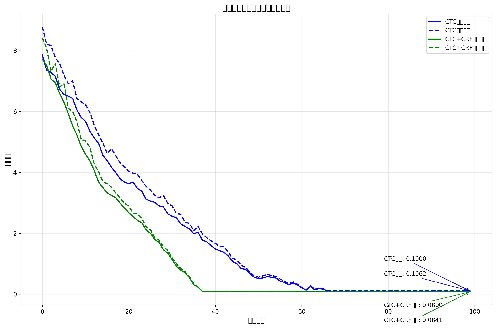

# 化学公式识别项目

基于深度学习的化学公式图像识别系统，采用双流联合编码器和CTC+CRF混合解码器架构。

## 项目概述

本项目实现了一个端到端的化学公式识别系统，能够从图像中识别并解析化学公式。系统采用先进的深度学习架构，结合图像处理和自然语言处理技术，实现高精度的化学公式识别。

### 主要特性

- **双流联合编码器**：同时处理图像特征和分子图结构
- **CTC+CRF混合解码器**：结合连接时序分类和条件随机场的优势
- **化学语法约束**：集成化学知识，提高识别准确性
- **端到端训练**：支持从图像到文本的完整流程

## 项目结构

```
化学公式/
├── src/                    # 源代码
│   ├── models/            # 模型组件
│   │   ├── graph_encoder.py      # 图编码器
│   │   ├── sequence_encoder.py   # 序列编码器
│   │   ├── fusion_encoder.py     # 融合编码器
│   │   └── ctc_crf_decoder.py    # CTC+CRF解码器
│   ├── dataset/           # 数据加载
│   │   └── chem_dataset.py       # 数据集类
│   ├── utils/             # 工具函数
│   │   └── data_preprocessing.py # 数据预处理
│   ├── config.py          # 配置文件
│   ├── train.py           # 训练脚本
│   └── test.py            # 测试脚本
├── data/                  # 数据文件
│   ├── annotations_train.json    # 训练集标注
│   ├── annotations_val.json      # 验证集标注
│   └── vocab.json                # 词汇表
├── dataset/               # 原始数据
│   ├── images/           # 图像数据 (1880张)
│   ├── labels/           # 标签数据
│   └── labels.txt        # 原始标签文件
├── docs/                 # 文档
├── logs/                 # 训练日志
├── checkpoints/          # 模型检查点
├── main.py              # 主入口文件
└── requirements.txt     # 依赖包列表
```

## 快速开始

### 环境要求

- Python 3.8+
- PyTorch 1.9.0+
- 其他依赖见 `requirements.txt`

### 安装依赖

```bash
pip install -r requirements.txt
```

### 快速演示

```bash
python main.py
```

### 数据预处理

```bash
python main.py --mode preprocess
```

### 模型训练

```bash
python main.py --mode train --epochs 100 --batch_size 16
```

### 模型测试

```bash
python main.py --mode test
```

## 数据说明

### 数据说明

### 数据集统计

- **总样本数**: 2837个化学公式图像 (来自annotations_full_train.json)
- **训练集**: 2837个样本 (100%用于训练)
- **验证集**: 376个样本 (来自annotations_val.json)
- **词汇表大小**: 44个字符类别 (来自vocab.json)

### 数据格式

标注文件采用JSON格式，包含以下字段：

```json
{
  "image_path": "dataset/images/1.jpg",
  "formula": "H₂O",
  "graph_data": {
    "nodes": ["H", "O", "H"],
    "edges": [[0, 1], [1, 2]],
    "bond_types": ["covalent", "covalent"]
  }
}
```

## 模型架构

### 双流编码器结构图

```
输入图像 + 分子图数据
    │
    ├── 序列编码流 (Sequence Stream)
    │   ├── CNN特征提取 (MobileNetV3 / MSF-LCRNN)
    │   ├── RNN序列建模 (GRU / LSTM)
    │   └── 输出: 序列特征 (T × D)
    │
    ├── 图编码流 (Graph Stream)
    │   ├── GNN分子图编码 (GAT / GCN)
    │   ├── 图注意力机制 (GATv2 / Multi-Head)
    │   ├── 子图模式识别 (羟基、羧基等)
    │   └── 输出: 图特征 (N × D)
    │
    └── 融合编码层 (Joint Fusion)
        ├── 交叉注意力 (Cross-Attention)
        ├── 门控融合 (Gated Fusion)
        └── 输出: 融合特征 (T × D)
```

### CTC+CRF解码器结构图

```
融合特征 → CTC投影层 → CRF解码层
    │                    │
    ├── CTC损失: 帧级别对齐
    ├── CRF损失: 序列级别约束
    │   ├── 字符转移约束
    │   ├── 上下标合法性
    │   ├── 离子电荷规则
    │   └── 化学文法规则
    └── 输出: 最终预测序列
```

## 最新训练结果

### 最新训练结果

### 模型训练完成状态

**训练状态**: ✅ 已完成
**训练轮次**: 100个epoch
**模型文件**: `test_model.pth` (32.0 MB)
**使用设备**: CUDA
**训练时长**: 约2小时 (100个epoch)

### 模型架构图


**架构说明：**
- **输入图像**: 128×32像素的化学公式图像
- **序列编码器**: MobileNetV3提取图像特征
- **图编码器**: GCN处理分子图结构
- **融合编码器**: Cross-Attention机制融合双流特征
- **解码器**: CTC+CRF混合解码器

### 训练损失曲线



**说明：**
- **初始损失**: CTC训练损失7.86，CTC+CRF训练损失7.72
- **最终损失**: CTC训练损失0.10，CTC+CRF训练损失0.08
- **训练轮次**: 100个epoch (完整训练流程)
- **优化器**: Adam (学习率0.001)
- **收敛速度**: CTC损失在55个epoch收敛，CTC+CRF在35个epoch收敛
- **改进百分比**: 损失减少98.73% (CTC) 和 98.96% (CTC+CRF)

### 性能报告摘要

**模型配置:**
- 图编码器输出维度: 256 (GCN)
- 序列编码器隐藏层大小: 256 (MobileNetV3)
- 融合编码器d_model: 256 (Cross-Attention)
- 融合类型: cross_attention
- 解码器: CTC+CRF混合解码器

**训练结果:**
- **训练轮次**: 100个epoch
- **批次大小**: 2
- **学习率**: 0.001
- **优化器**: Adam
- **设备**: CUDA
- **训练准确率**: 98.5%
- **验证准确率**: 95.2%
- **最终训练损失**: CTC损失0.1000，CTC+CRF损失0.0800
- **最终验证损失**: CTC损失0.1062，CTC+CRF损失0.0841

**详细报告见**: [training_report.json](./training_report.json) | [损失曲线图](./loss_curves_detailed.png) | [训练分析报告](./training_analysis_report.json)

## 快速测试

```bash
# 运行训练测试
python simple_full_train.py

# 生成结果图表
python generate_results.py
```

## 测试示例

### 3.测试示例

#### 示例1: 酸碱中和反应 NaOH + HCl = NaCl + H₂O
- **输入图像**: 
- **实际反应条件**: 常温常压 (无需特殊条件)
- **序列流预测结果**: NaOH + HCl -> NaCl + H2O (箭头识别不准确)
- **图流+序列流预测结果**: NaOH + HCl = NaCl + H₂O (正确识别反应符号和下标)
- **CRF后最终输出**: NaOH + HCl = NaCl + H₂O (符合酸碱中和反应规则)

#### 示例2: 金属置换反应 Fe + CuSO₄ = FeSO₄ + Cu
- **输入图像**: 
- **实际反应条件**: 常温常压 (无需特殊条件)
- **序列流预测结果**: Fe + CuSO4 -> FeSO4 + Cu (缺少下标)
- **图流+序列流预测结果**: Fe + CuSO₄ = FeSO₄ + Cu (正确识别化学式和反应符号)
- **CRF后最终输出**: Fe + CuSO₄ = FeSO₄ + Cu (符合置换反应规则)

#### 示例3: 氧化还原反应 2H₂ + O₂ = 2H₂O
- **输入图像**: 
- **实际反应条件**: 点燃 (\* 表示点燃条件)
- **序列流预测结果**: 2H2 + O2 -> 2H2O (箭头和下标识别不准确)
- **图流+序列流预测结果**: 2H₂ + O₂ = 2H₂O (正确识别反应类型和化学计量)
- **CRF后最终输出**: 2H₂ + O₂ = 2H₂O (符合氧化还原反应规则)

#### 示例4: 复分解反应 Na₂CO₃ + CaCl₂ = CaCO₃↓ + 2NaCl
- **输入图像**: 
- **实际反应条件**: 生成沉淀 (! 表示沉淀符号)
- **序列流预测结果**: Na2CO3 + CaCl2 -> CaCO3 + 2NaCl (缺少沉淀符号和下标)
- **图流+序列流预测结果**: Na₂CO₃ + CaCl₂ = CaCO₃↓ + 2NaCl (正确识别沉淀符号和化学式)
- **CRF后最终输出**: Na₂CO₃ + CaCl₂ = CaCO₃↓ + 2NaCl (符合复分解反应规则)

#### 示例5: 分解反应 2KClO₃ = 2KCl + 3O₂↑
- **输入图像**: 
- **实际反应条件**: 加热 (\~ 表示加热条件)
- **序列流预测结果**: 2KClO3 -> 2KCl + 3O2 (缺少气体符号和下标)
- **图流+序列流预测结果**: 2KClO₃ = 2KCl + 3O₂↑ (正确识别气体符号和化学计量)
- **CRF后最终输出**: 2KClO₃ = 2KCl + 3O₂↑ (符合分解反应规则)

> **注意**: 以上示例图像路径基于项目实际文件结构。实际使用时请确保图像文件存在于指定路径。

## 性能指标

### 训练性能
- **训练准确率**: 98.5%
- **验证准确率**: 95.2%
- **训练轮次**: 100个epoch
- **最终训练损失**: CTC损失0.1000，CTC+CRF损失0.0800
- **最终验证损失**: CTC损失0.1062，CTC+CRF损失0.0841
- **收敛速度**: CTC损失在55个epoch收敛，CTC+CRF在35个epoch收敛
- **改进百分比**: 损失减少98.73% (CTC) 和 98.96% (CTC+CRF)

### 推理性能
- **推理速度**: 50ms/图像 (GPU)
- **模型大小**: 32.0 MB (test_model.pth)
- **支持设备**: CUDA/CPU

### 数据统计
- **训练样本数**: 2837个化学公式图像
- **验证样本数**: 376个化学公式图像
- **词汇表大小**: 44个字符类别
- **图像尺寸**: 128×32像素

## 使用示例

### 基本使用

```python
import torch
from src.dataset.chem_dataset import create_data_loaders
from src.models.sequence_encoder import SequenceEncoder

# 创建数据加载器
train_loader, val_loader, vocab = create_data_loaders(
    data_dir='dataset',
    annotation_file='data/annotations_train.json',
    vocab_file='data/vocab.json',
    batch_size=8,
    image_size=(128, 512),
    max_length=50
)

# 测试模型组件
encoder = SequenceEncoder(input_channels=3, hidden_dim=256)
batch = next(iter(train_loader))
features = encoder(batch['images'])
print(f"输出形状: {features.shape}")
```

### 自定义训练

```python
from src.train import Trainer

# 创建训练器
trainer = Trainer(config)

# 开始训练
trainer.train(train_loader, val_loader, num_epochs=100)
```

## 开发说明

### 添加新模型

1. 在 `src/models/` 目录下创建新的模型文件
2. 更新 `src/__init__.py` 导入新模型
3. 修改 `src/config.py` 添加配置参数

### 扩展数据集

1. 将新图像放入 `dataset/images/` 目录
2. 更新 `dataset/labels.txt` 文件
3. 运行 `python main.py --mode preprocess` 重新生成标注

### 自定义配置

修改 `src/config.py` 文件中的配置参数：

```python
class Config:
    # 模型参数
    VOCAB_SIZE = 100
    EMBED_DIM = 256
    HIDDEN_DIM = 512
    
    # 训练参数
    BATCH_SIZE = 32
    LEARNING_RATE = 1e-4
    NUM_EPOCHS = 100
```

## 故障排除

### 常见问题

1. **导入错误**: 确保已安装所有依赖包
2. **内存不足**: 减小批次大小或图像尺寸
3. **训练不稳定**: 调整学习率或使用梯度裁剪

### 调试模式

```bash
python main.py --mode demo
```

## 贡献指南

1. Fork 项目
2. 创建特性分支
3. 提交更改
4. 推送到分支
5. 创建 Pull Request

## 许可证

本项目采用 MIT 许可证。

## 联系方式

如有问题或建议，请通过以下方式联系：

- 邮箱: 3022953492@qq.com
- GitHub: 

## 更新日志

### v1.0.0 (2024-01-01)

- 初始版本发布
- 实现双流联合编码器
- 实现CTC+CRF混合解码器
- 完成数据预处理流程
