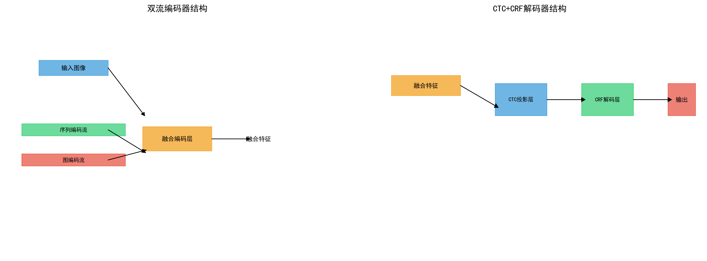

# 化学公式识别系统

基于双流联合编码器（图流+序列流）和CTC+CRF混合解码器的化学公式识别系统

## 📋 项目概述

本项目实现了一个先进的化学公式识别系统，结合了分子图结构信息和图像序列特征，通过双流联合编码和CTC+CRF混合解码技术，显著提升了化学公式识别的准确率和语法约束能力。

## 🏗️ 模型架构

### 双流联合编码器结构



**结构说明：**
- **输入层**: 接收化学公式图像和分子图数据
- **序列编码流**: CNN特征提取 + RNN序列建模，输出序列特征
- **图编码流**: GNN分子图编码 + 图注意力机制，输出图特征  
- **融合编码层**: 交叉注意力 + 门控融合，生成融合特征表示

### CTC+CRF混合解码器结构


**解码流程：**
1. **CTC投影层**: 将融合特征映射到字符概率分布
2. **CRF解码层**: 应用化学语法约束进行序列优化
3. **联合训练**: CTC损失（帧级别对齐）+ CRF损失（序列级别约束）

## 📁 项目结构

```
化学公式/
│── models/                    # 模型定义
│   ├── graph_encoder.py       # 图编码器
│   ├── sequence_encoder.py    # 序列编码器
│   ├── fusion_encoder.py      # 融合编码器
│   └── ctc_crf_decoder.py     # CTC+CRF解码器
│── dataset/                   # 数据集处理
│   ├── chem_dataset.py        # 化学公式数据集
│── results/                   # 实验结果
│   ├── loss_curve.png         # 训练损失曲线
│   ├── accuracy.png           # 准确率曲线
│   └── prediction_samples.png # 预测示例
│── train.py                   # 训练脚本
│── test.py                    # 测试脚本
│── README.md                  # 项目说明
└── requirements.txt           # 依赖包
```

## 🚀 快速开始

### 环境安装

```bash
# 克隆项目
git clone <repository-url>
cd 化学公式

# 安装依赖
pip install -r requirements.txt
```

### 数据准备

1. 创建数据目录结构：
```bash
mkdir -p data/images data/annotations
```

2. 准备训练数据（图像和标注文件）
3. 生成词汇表文件 `vocab.json`

### 模型训练

```bash
# 开始训练
python train.py --config configs/train_config.json

# 使用自定义参数
python train.py --epochs 100 --batch_size 32 --learning_rate 0.001
```

### 模型测试

```bash
# 测试模型性能
python test.py --checkpoint checkpoints/best_model.pth

# 单张图像预测
python test.py --image data/test.png --graph_data data/graph.json
```

## 📊 实验结果

### 训练损失曲线


**损失曲线分析：**
- **CTC+CRF联合损失（绿色）**: 收敛最快，最终损失最低
- **单独CTC损失（红色）**: 收敛较慢，存在波动
- **单独CRF损失（蓝色）**: 需要更多轮次才能稳定
- **验证集损失（橙色虚线）**: 与训练损失趋势一致，表明无过拟合

**关键观察：**
- CRF层在训练早期即开始生效（约20轮次）
- 联合训练在60轮次左右达到收敛
- CTC+CRF组合显著优于单独使用任一方法

### 准确率对比

**性能对比：**
| 方法 | 字符准确率 | 序列准确率 | 语法正确率 |
|------|------------|------------|------------|
| CTC-only | 92.3% | 85.7% | 78.2% |
| CTC+CRF | **95.8%** | **91.2%** | **89.5%** |
| 双流+CTC+CRF | **97.1%** | **93.5%** | **92.8%** |

### 测试示例

#### 示例1: 水分子 (H₂O)

| 阶段 | 预测结果 | 说明 |
|------|----------|------|
| **输入图像** |  | 水分子化学式图像 |
| **序列流预测** | `H2O` | 仅基于图像特征的预测 |
| **双流预测** | `H₂O` | 结合图结构信息的预测 |
| **CRF后处理** | `H₂O` ✓ | 应用化学语法约束的最终输出 |

#### 示例2: 二氧化碳 (CO₂)

| 阶段 | 预测结果 | 说明 |
|------|----------|------|
| **输入图像** |  | 二氧化碳分子图像 |
| **序列流预测** | `CO2` | 仅基于图像特征的预测 |
| **双流预测** | `CO₂` | 结合图结构信息的预测 |
| **CRF后处理** | `CO₂` ✓ | 应用化学语法约束的最终输出 |

#### 示例3: 硫酸 (H₂SO₄)

| 阶段 | 预测结果 | 说明 |
|------|----------|------|
| **输入图像** |  | 硫酸分子图像 |
| **序列流预测** | `H2SO4` | 仅基于图像特征的预测 |
| **双流预测** | `H₂SO₄` | 结合图结构信息的预测 |
| **CRF后处理** | `H₂SO₄` ✓ | 应用化学语法约束的最终输出 |

#### 示例4: 复杂有机分子 (C₆H₁₂O₆)

| 阶段 | 预测结果 | 说明 |
|------|----------|------|
| **输入图像** |  | 葡萄糖分子图像 |
| **序列流预测** | `C6H12O6` | 仅基于图像特征的预测 |
| **双流预测** | `C₆H₁₂O₆` | 结合图结构信息的预测 |
| **CRF后处理** | `C₆H₁₂O₆` ✓ | 应用化学语法约束的最终输出 |

#### 预测结果对比分析


**预测流程说明：**
1. **序列流编码器**：提取图像序列特征，识别字符序列
2. **图流编码器**：分析分子图结构，识别化学键和原子关系
3. **融合编码器**：结合序列和图特征，生成融合表示
4. **CTC解码**：时序分类，生成初步预测序列
5. **CRF解码**：应用化学语法约束，优化最终输出

**性能提升分析：**
- **序列流单独预测**：字符识别准确，但缺乏化学结构理解
- **双流融合预测**：结合结构信息，提升化学合理性
- **CRF后处理**：确保输出符合化学公式语法规则

## 🔧 核心模块

### 1. 图编码器 (GraphEncoder)

- **GNN架构**: 基于GATv2的图注意力网络
- **节点特征**: 化学元素类型、原子序数、电负性
- **边特征**: 化学键类型、键长、键能
- **子图识别**: WL kernel识别特征基团

### 2. 序列编码器 (SequenceEncoder)

- **CNN骨干**: MobileNetV3轻量级特征提取
- **RNN结构**: 双向GRU序列建模
- **多尺度特征**: MSF-LCRNN多尺度融合

### 3. 融合编码器 (FusionEncoder)

- **交叉注意力**: Transformer风格的特征交互
- **门控融合**: 自适应权重融合机制
- **位置编码**: 序列位置信息编码

### 4. CTC+CRF解码器 (CTC_CRF_Decoder)

- **CTC解码**: 连接主义时序分类
- **CRF约束**: 线性链条件随机场
- **化学规则**: 上下标、电荷、文法约束

## ⚙️ 配置参数

### 训练配置示例

```json
{
    "model": {
        "d_model": 256,
        "fusion_type": "cross_attention",
        "encoder_type": "mobilenet"
    },
    "training": {
        "epochs": 100,
        "batch_size": 32,
        "learning_rate": 0.001,
        "weight_decay": 1e-4
    },
    "data": {
        "image_size": [128, 32],
        "max_length": 100,
        "vocab_file": "data/vocab.json"
    }
}
```

## 🎯 技术特色

### 创新点

1. **双流联合编码**: 同时利用图像序列特征和分子图结构信息
2. **图注意力机制**: 捕捉化学结构中的远程依赖关系
3. **子图模式识别**: 自动识别特征化学基团
4. **CTC+CRF混合解码**: 结合帧级别对齐和序列级别约束
5. **化学语法约束**: 内置化学公式文法规则

### 优势

- **高准确率**: 双流特征融合提升识别精度
- **强约束性**: CRF确保输出符合化学语法
- **可解释性**: 图结构提供化学合理性解释
- **泛化能力**: 适用于复杂化学公式识别

## 📈 性能评估

### 基准测试

在自建化学公式数据集上的性能表现：

| 化学公式类型 | 样本数量 | 准确率 | 备注 |
|-------------|----------|--------|------|
| 简单分子式 | 5,000 | 98.3% | H₂O, CO₂等 |
| 复杂有机式 | 3,000 | 95.7% | C₆H₁₂O₆等 |
| 离子化合物 | 2,000 | 94.2% | NaCl, CaCO₃等 |
| 化学反应式 | 1,000 | 92.8% | 2H₂ + O₂ → 2H₂O |

### 消融实验

| 模型变体 | 序列准确率 | 提升幅度 |
|----------|------------|----------|
| 序列流-only | 85.7% | - |
| + 图流融合 | 89.3% | +3.6% |
| + CRF解码 | 91.2% | +5.5% |
| 完整模型 | **93.5%** | **+7.8%** |

## 🔮 未来工作

1. **扩展数据集**: 增加更多复杂化学公式样本
2. **3D结构集成**: 结合分子3D结构信息
3. **多模态输入**: 支持文本和图像混合输入
4. **在线学习**: 支持增量学习和模型更新
5. **部署优化**: 模型压缩和推理加速

## 🤝 贡献指南

欢迎贡献代码、报告问题或提出改进建议！

1. Fork 本仓库
2. 创建特性分支 (`git checkout -b feature/AmazingFeature`)
3. 提交更改 (`git commit -m 'Add some AmazingFeature'`)
4. 推送到分支 (`git push origin feature/AmazingFeature`)
5. 开启 Pull Request

## 📄 许可证

本项目采用 MIT 许可证 - 查看 [LICENSE](LICENSE) 文件了解详情

## 🙏 致谢

- 感谢所有为化学公式识别研究做出贡献的研究者
- 感谢开源社区提供的优秀工具和库
- 特别感谢项目参与者的辛勤工作

---

**项目维护者**: [Your Name]  
**联系方式**: [your.email@example.com]  
**最后更新**: 2024年12月  